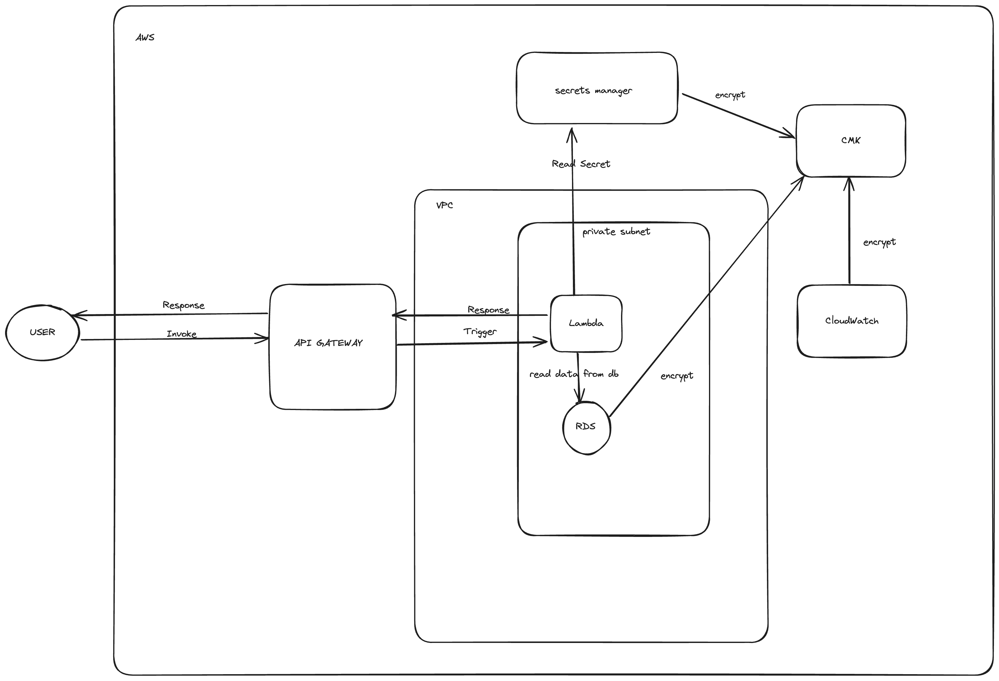

# Serverless Restaurant Recommendation API

This project provides a serverless API to recommend restaurants based on various filters (style, vegetarian, delivery, etc.).
The API is implemented using AWS Lambda, Api Gateway and is deployed using Terraform for infrastructure management.

## Prerequisites

Before you begin, ensure you have the following installed:

- 🐙 Git  
- 🐍 Python 3.9  
- 🌍 Terraform v1.5.7  
- ☁️ AWS CLI (configured with your AWS credentials)

## 🚀 Installation Instructions

### 1. 🧱 Clone the Repository
Clone the GitHub repository to your local machine:

```bash
git clone https://github.com/your-username/serverless-restaurant-recommendation.git
cd serverless-restaurant-recommendation
```

### 2. 📦 Install Python Dependencies
Ensure that your Python dependencies are up to date.
In case there are any new dependencies, you can install them by running the following:

```bash
pip install -r requirements.txt -t terraform/modules/serverless-restaurant/src
```

### 3. Terraform Deployment
```bash
cd terraform/deplyments/serverless-restaurant
terraform init
terraform apply
```

### How To Invoke

After running terraform apply, the URL for the API Gateway will be displayed as an output.

Once you have the URL, you can invoke the Lambda function using curl with the following command:

```bash
curl -v "<URL>" \
     -H "Content-Type: application/json" \
     -d '{"body": "vegetarian italian open now"}'
```

### Architecture




## 💰 Pricing

For 50 million Lambda invocations and API Gateway requests per month, the estimated costs are:

### Lambda Cost
 **Invocations**: ~$10

### API Gateway Cost 
 **Requests**: ~$175

### Additional Notes
- The pricing can vary based on the actual data transfer, memory configuration, and execution time of your Lambda functions.
- For large-scale applications, extra charges for data transfer and CPU usage may apply.

 🧪 **Notes**:
- The code has not been fully tested in a cloud environment, as it has not been deployed or executed on AWS.
  Some parts of the functionality may need further testing and adjustments before deployment.


- Moreover, The current Python implementation is designed to handle a specific input structure tailored to a particular
  use cases.

  To support more generalized or diverse inputs, especially those expressed in natural language,
  we may consider integrating **NLP** or **LLM** techniques.
